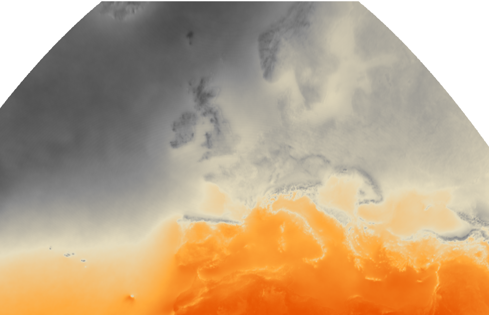

#  Yearly Sunshine Hours — Data Source Notes

## Source of data

The source is **CM SAF SARAH-3** (Surface Solar Radiation Data Set — Heliosat, Edition 3), the **SDU** (Sunshine Duration) product, published by EUMETSAT's Satellite Application Facility on Climate Monitoring (CM SAF), operated by DWD (Deutscher Wetterdienst — the German national meteorological service).

- **Variable:** `SDU` — `duration_of_sunshine`, monthly sums in hours (`units="h"`)
- **DOI:** [10.5676/EUM_SAF_CM/SARAH/V003](https://doi.org/10.5676/EUM_SAF_CM/SARAH/V003) — official permanent link to cite the dataset
- **Instrument/platform:** [SEVIRI on Meteosat-11](https://www.eumetsat.int/meteosat-second-gen-instruments)
- **Spatial coverage:** [±65° latitude, ±65° longitude](https://user.eumetsat.int/s3/eup-strapi-media/SIS_Climatology_CMSAF_SARAH_3_Full_Disc_6dcb1c33ee.png), 0.05° resolution (2600×2600 grid)
- **Format:** [NetCDF (CF-1.7 / ACDD-1.3 conventions)](https://www.cen.uni-hamburg.de/en/icdc/data/land/docs-land/saf-cm-dwd-pum-meteosat-hel-sarah-3-3.pdf), packed as `Int16` with `scale_factor=0.1`, `add_offset=0`, `_FillValue=-999`
- **Filenames:** `SDUms<YYYYMMDD><HHMMSS>...nc` (one file per calendar month)

## How to obtain the data

1. Register a free account at the CM SAF web portal: [wui.cmsaf.eu](https://wui.cmsaf.eu/safira/).
2. Order the SARAH-3 SDU product for the desired date range and region via the product page (product/experiment IDs, e.g. `fid=36&eid=22199_22482`).
3. Download the delivered `.nc` files (one per month) from the resulting order folder (e.g. `ORD69093/`).
4. No paid license or API key is required; CM SAF data is licensed under the **[EUMETSAT CM SAF Products Licence](https://cds.climate.copernicus.eu/licences/eumetsat-cm-saf)** — a distinct, custom EUMETSAT license (not CC-BY): free of charge, no usage restrictions, but requiring the copyright credit "Copyright (c) (year) EUMETSAT" to be displayed wherever the products are used, published, or shown.

## Why this dataset

- **Satellite-derived, gap-free coverage** — unlike ground station networks, SARAH-3 covers all of Europe, North Africa, and the North Atlantic uniformly, with no station-density bias.
- **Standardized physical definition** — sunshine duration follows the WMO definition (direct normal irradiance ≥ 120 W/m²), matching the classical [Campbell-Stokes recorder threshold](https://en.wikipedia.org/wiki/Campbell%E2%80%93Stokes_recorder), so results are comparable across the whole domain and to historical ground records.
- **Monthly sums, multi-year archive** — well suited to building a representative "average annual" climatology by averaging each calendar month across several years before summing to an annual total, rather than relying on a single, possibly anomalous year.
- **Rich embedded metadata** — CF-compliant global ([Climate and Forecast (CF) Metadata Conventions](https://cfconventions.org/conventions.html)) and variable attributes (creator, [DOI](https://en.wikipedia.org/wiki/Digital_object_identifier), geospatial bounds, `scale_factor`/`add_offset`/units) allow the pipeline to validate the data automatically instead of assuming units, catching packing or scaling errors before they silently corrupt results.

## What was the goal

Build a small, auditable pipeline that turns raw monthly satellite data files into a web-map-ready sunshine layer:

1. **Crop and average** — read the sunshine-duration variable and its coordinate boundary arrays, crop to a bounding box, and average matching calendar months across all available years into one representative annual sunshine-duration grid (in hours), correctly unpacking the packed `Int16` values via their validated `scale_factor`/`add_offset`.
2. **Composite GeoTIFF** — write the result as a georeferenced GeoTIFF ([EPSG:4326](https://epsg.io/4326)) with minimal required metadata (CRS, affine transform, nodata, dtype) plus maintenance-oriented provenance tags (source files, time coverage, processing description, institution) — usable for direct lat/lon point queries.
3. **Colormap sidecar** — since GeoTIFF/NetCDF headers have no canonical colormap field, a JSON sidecar stores the dynamically computed data range, a dark-grey-to-orange color ramp, the target reprojection (EPSG:3857 for web display), and a `zoom_resampling` hint for client-side GPU filtering.
4. **PNG preview** — render a Web-Mercator-reprojected PNG strictly from the GeoTIFF + sidecar, ready to be displayed in a web-based interactive map via a simple image overlay (or later, a tiled raster source / direct cloud-optimized GeoTIFF loading). The grey-to-orange color scheme was visually inspired by the [Copernicus Climate Change Service's 2025 State of the Climate: clouds and sunshine report](https://climate.copernicus.eu/esotc/2025/clouds-and-sunshine).

The end goal is two things you can use together: a picture layer you can show on a map, and a data layer you can query directly to get the exact value at any point.